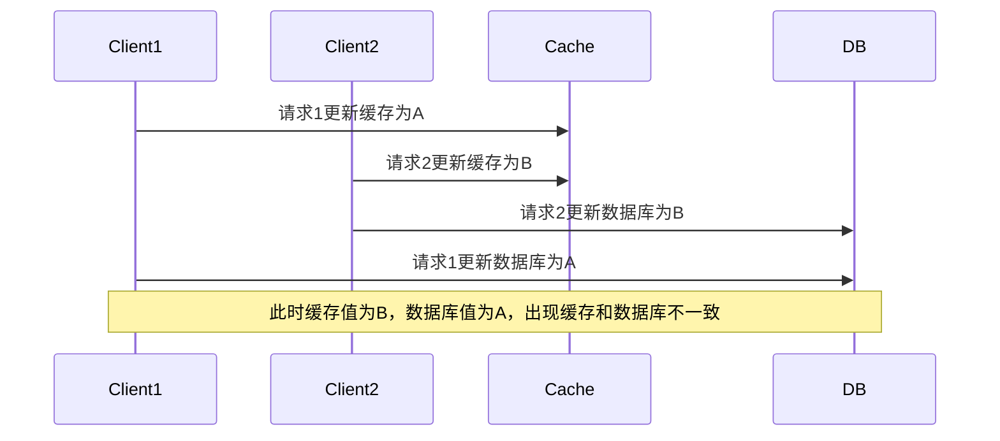
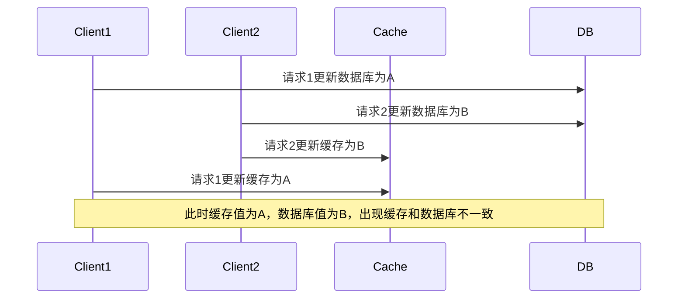
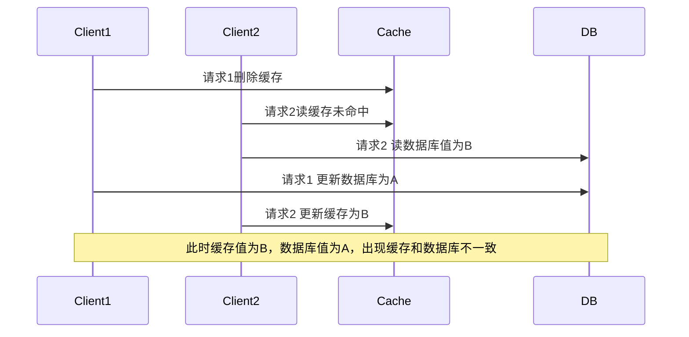
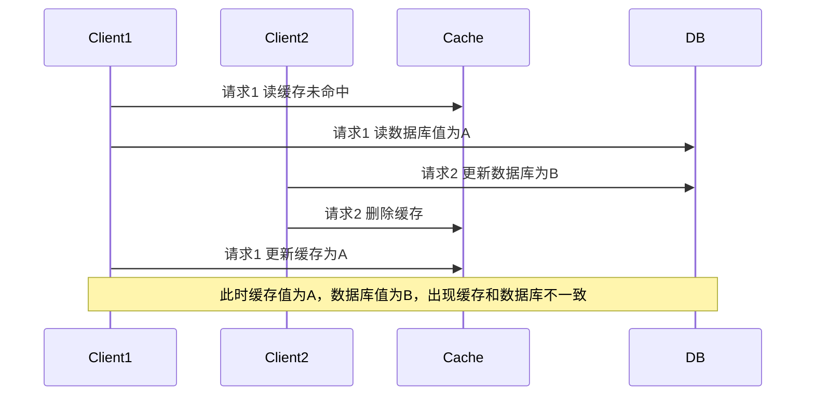
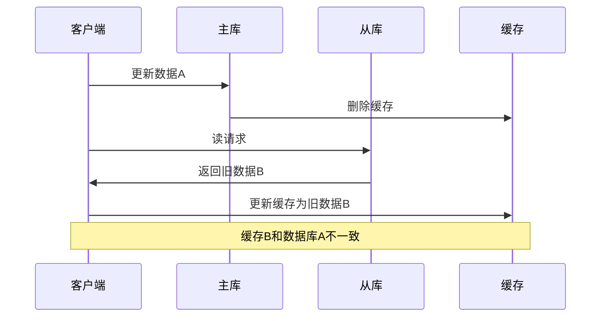

# 缓存

核心思想就是将频繁使用的数据，计算结果暂存在速度更快，但是空间不大的存储介质中。减少对慢速设备访问，提高系统整体速度。

依赖于局部性原理

有硬件缓存：CPU缓存，硬盘缓存

软件缓存：内存缓存（页面缓存，浏览器缓存），数据库缓存

分布式缓存：redis,Memcached,Caffine等

引入了缓存，系统的性能提高了，但是系统复杂度也增大了，因此不可避免带来了缓存一致性问题:缓存中的数据与原始数据源可能存在不一致（例如：数据源的A数据更新后，缓存中的A数据未同步更新）。

# 缓存数据库一致性

1. 常见的缓存更新策略
2. 怎么保证缓存数据库一致性
3. 更新缓存还是删除缓存，删除失败了怎么办
4. 读写分离的场景下还能保证一致性吗
5. 先写缓存还是先写数据库
6. ...

## 1. cache side 旁路缓存

平时使用redis都是旁路缓存。

先读缓存，缓存不存在则去数据库读取，返回结果并将结果存到缓存中，方便下次读取。

缓存和数据库都要操作，以数据库数据为主。

这是业务缓存中最常见的方法。

### 以下是一致性方法+不一致的情况

### 先更新缓存，再更新数据库

更新数据库和缓存的是两个操作，不是原子性的，中间可能会被插一腿,出现并发问题

### 先更新数据库，在更新缓存

问题同上

### 加锁

以上两种方法因为无法保证原子性出现了并发问题，我们可以加分布式锁写数据库和写缓存操作上。

但是这样会大大降低并发度。

换个思路，用删除缓存,并且删除缓存的代价肯定比更新缓存低(  缓存结果需要进行复杂计算，还可能后面用不上就又被更新）。

所以在查数据时，缓存查不到时，在查数据库的时候顺带更新比较好。

在写数据时，删除缓存。

### 先删除缓存，再更新数据库

有一定概率会发生

### 延迟双删

在上一种方法的基础上在删一次，先删除缓存后，更新数据库，线程等待一会儿再删一次缓存(等待其他线程读取数据库并更新缓存)

问题：请求1要等多久才能等待其他线程读数据库并且写缓存结束？ 情况复杂

### 先更新数据库，再删除缓存

发生概率很小，

- 这个key缓存失效，又紧接着要更新数据库
- 请求2更新数据库+删除缓存  耗时 < 请求1更新缓存，  显然概率很低

但是删除缓存失败了怎么办

### 先更新数据库，再异步可重试删除缓存

删除缓存失败了，就会导致不一致。

问题在于怎么保证删除缓存成功

- 侵入业务逻辑：使用mq异步删除缓存，可以重试
- 非侵入业务逻辑：或者监听数据库更新binlog，然后删除缓存，可以重试。 

### 数据库读写分离

主库只能写，从库只能读。

主库数据会领先于从库。

发生概率也不高）

解决办法就是更新主库后的一段时间，让所有读请求打到主库

### 总结

因此我们想了各种策略追求缓存数据库的尽量一致性,但是不可能完全一致的，数据库和缓存是两个系统。

但是通过我们的各种方法，能保证大部分时间是一致的，再给缓存key加过期时间,即使极端情况下不一致了，也能过一会儿让脏数据自动丢失。

## 2. read/write through

写：直接写缓存，让缓存自己去更新数据库

读：读缓存，缓存没有，缓存再去从数据库中获取。

显然这是以缓存为主，只操作缓存。

## 3. write back

写回、异步写缓存

类似上面，只操作缓存，让缓存自身去读写数据库，但是是异步批量的写缓存。

适合写多读少的场景，但是异步写回，存在数据丢失风险。

## 总结

2,3这种思想，在我们操作业务缓存时用的不多，缓存中间件一般也不提供缓存和数据库交互的方法，但是在操作系统缓存，中间件设计是很常用的思想。

如mysql的buffer pool，操作系统的page cache，就是异步刷盘。还有文本编辑器的定时自动保存
