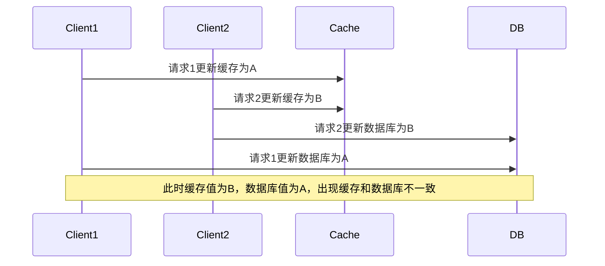

# 缓存

核心思想就是将频繁使用的数据，计算结果暂存在速度更快，但是空间不大的存储介质中。减少对慢速设备访问，提高系统整体速度。

依赖于局部性原理

有硬件缓存：CPU缓存，硬盘缓存

软件缓存：内存缓存（页面缓存，浏览器缓存），数据库缓存

分布式缓存：redis,Memcached,Caffine等

引入了缓存，系统的性能提高了，但是系统复杂度也增大了，因此不可避免带来了缓存一致性问题:缓存中的数据与原始数据源可能存在不一致（例如：数据源的A数据更新后，缓存中的A数据未同步更新）。

# 缓存数据库一致性

1. 常见的缓存更新策略
2. 怎么保证缓存数据库一致性
3. 更新缓存还是删除缓存，删除失败了怎么办
4. 读写分离的场景下还能保证一致性吗
5. 先写缓存还是先写数据库
6. ...

## 1. cache side 旁路缓存

平时使用redis都是旁路缓存。

先读缓存，缓存不存在则去数据库读取，返回结果并将结果存到缓存中，方便下次读取。

缓存和数据库都要操作，以数据库数据为主。

这是业务缓存中最常见的方法。

### 先更新缓存，再更新数据库

## 2. read/write through

写：直接写缓存，让缓存自己去更新数据库

读：读缓存，缓存没有，缓存再去从数据库中获取。

显然这是以缓存为主，只操作缓存。

## 3. write back

写回、异步写缓存

类似上面，只操作缓存，让缓存自身去读写数据库，但是是异步批量的写缓存。

适合写多读少的场景，但是异步写回，存在数据丢失风险。

## 总结

2,3这种思想，在我们操作业务缓存时用的不多，缓存中间件一般也不提供缓存和数据库交互的方法，但是在操作系统缓存，中间件设计是很常用的思想。

如mysql的buffer pool，操作系统的page cache，就是异步刷盘。还有文本编辑器的定时自动保存
