先看完deepwiki上的英文文档

# redis是什么

一个又快又多功能的内存数据结构服务器，可以作为缓存，数据库，实现各种数据结构（限流器，排行榜），消息代理，搜索引擎使用。

消息代理，应该就是当消息队列，消息缓存来用。

搜索引擎？问豆包给出的答案是将搜索内容（文本，标签，属性等）拆分为 集合，有序集合，哈希表等，建立关键词到数据结构的映射。然后可以用这些数据结构的操作来实现一些基本的搜索功能，排序功能。redis好像还有一些可以安装的扩展模块，如RedisJSON，RediSearch。这样能在已有的redis集群上引入一个轻量级超速搜索。缺点就是功能一般，高级功能要引入扩展模块维护困难，并且受限于内存，索引设计需要合理点。

- 性能好：内存
- 灵活：数据结构丰富
- 扩展性强：模块化api
- 简单：RESP协议指令，文档多
- 多功能：落地实测多
- 认可度广：缓存，会话管理，队列，实时应用

由c实现了单线程事件驱动核心，可选的IO线程

核心架构部分:

- 事件驱动：AE事件驱动
- 统一对象模型：所有数据都是存为Redis Object，不同类型用不同编码
- 内存优先存储，可选持久化
- 扩展框架：模块API，内嵌LUA脚本
- 分布式English：支持集群和主从

核心源码在server.c .h相关文件

# Redis架构概览

- 系统概览

围绕redisServer结构体的分层系统

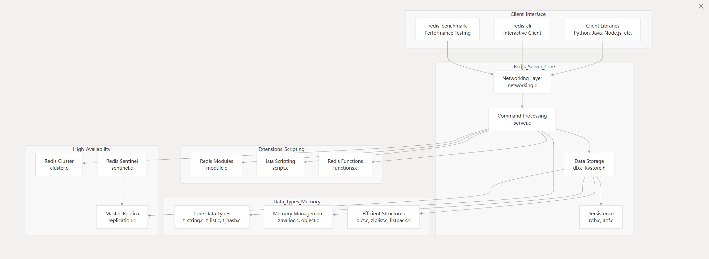

- 核心组成

全局变量server 结构体作为核心（存储服务器一些元数据），协调各个子系统

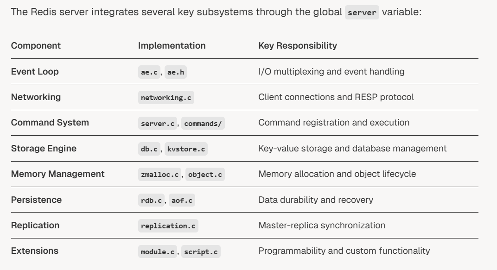

- 数据流

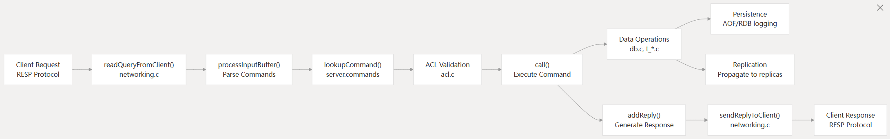

# 服务器核心组件

核心就是redisServer这个全局结构体和AE事件循环

这个全局结构体包含一些服务器状态

- 数据库数组
- 客户端连接
- 配置信息
- 主从状态
- 集群节点信息
- 模块管理：加载模块，注册命令

命令执行流水线

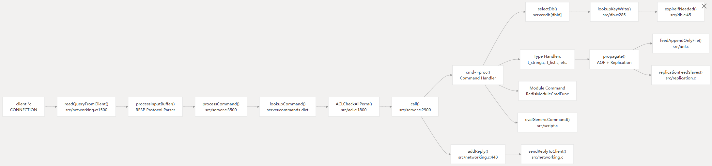

- client结构体：代表独立的客户端连接和查询与响应缓存
- redisCommand结构体：包含指令元信息，函数调用指针等
- server.command：指令名->redisCommand的哈希表
- server.db[]：数据库数组，每个数据库包含keys,expires 的kv存储实例
- call()函数：命令执行核心，包含监控，日志，传播功能
- proagate（）:确保命令执行传播到AOF文件和副本节点

# 数据管理系统

多层系统，围绕KV存储抽象，支持单节点和集群

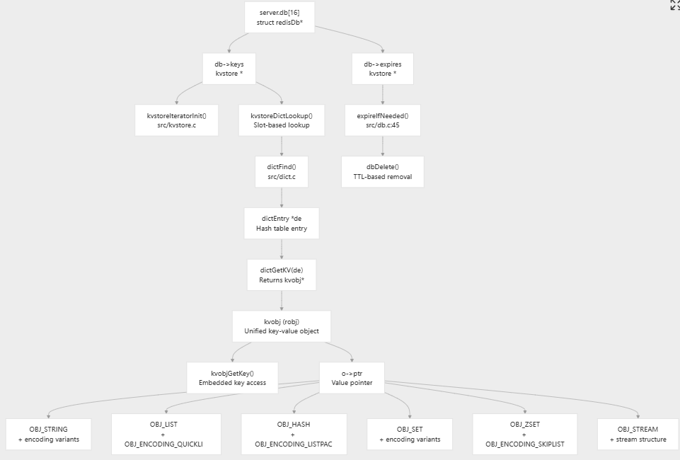

然后有一系列方法来读写key，管理key的过期。

kvobj继承了robj，将key 直接嵌入到结构体中，提升内存利用率，特别是小key。

减少内存碎片，提升缓存命中率。

# 持久化层

以下两种持久化机制可以独立或者协同工作。

## RDB快照

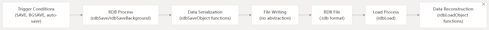

- 将数据序列化为压缩二进制数据流

- 后台保存，避免阻塞主线程

- 对于string值有可选的压缩算法

- CRC校验算法

  

## AOF日志

aof日志系统会记录命令，提供指定时间点的数据恢复

- 追加所有写命令
- 可以分为RDB格式的base file和AOF格式的增量文件
- 后台重写：定期重写AOF
- aofmanifest结构体管理aof文件

# 高可用系统

## 主从架构
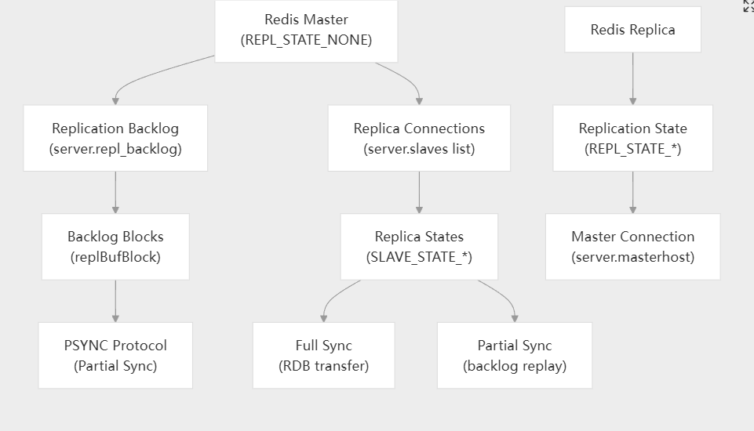

- 全量同步：初始传输RDB文件
- 部分同步：使用 replication backlog进行增量更新
- 副本状态管理：`REPL_STATE_*` and `SLAVE_STATE_*` 常量

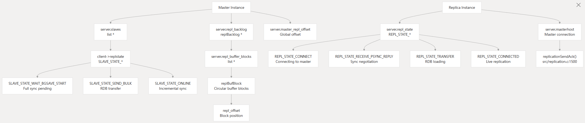

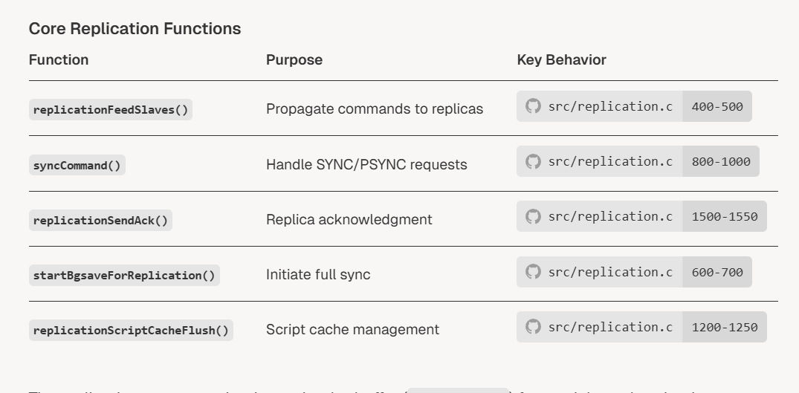

实现部分同步中，采用了一个环形缓冲池repl_backlog，让副本从指定的偏移量开始部分同步。

# 集群模式

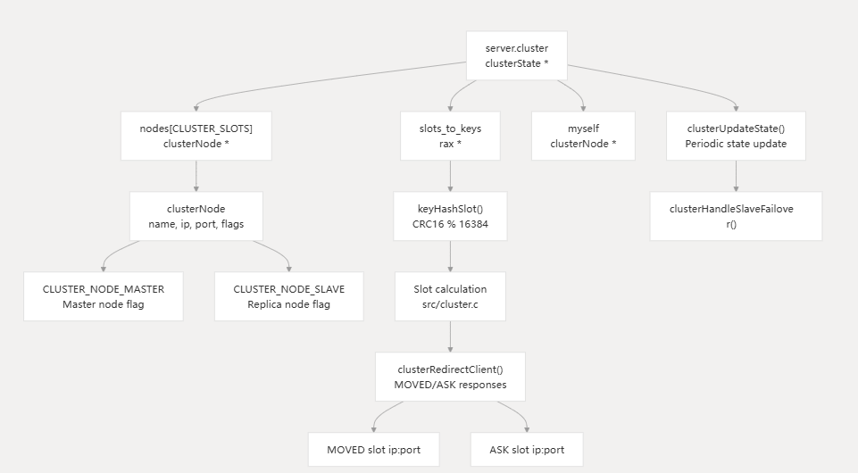

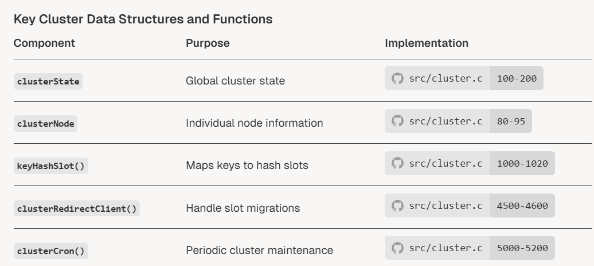

# 构建指南

介绍了一系列redis开发部署运维测试工具

# 扩展框架

redis提供多种机制可供扩展

## 模块系统

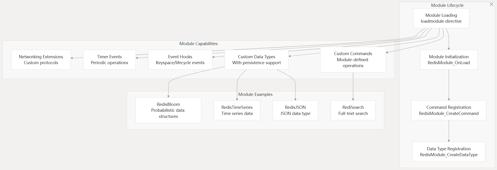

- 命令注册：可以自定义指令
- 可以扩展数据类型，支持持久化和副本
- 事件通知：key空间的时间，客户端连接，服务器生命周期等
- 内存管理：追踪redis内存使用情况
- 网络：自定义网络协议处理器和管理

## LUA脚本

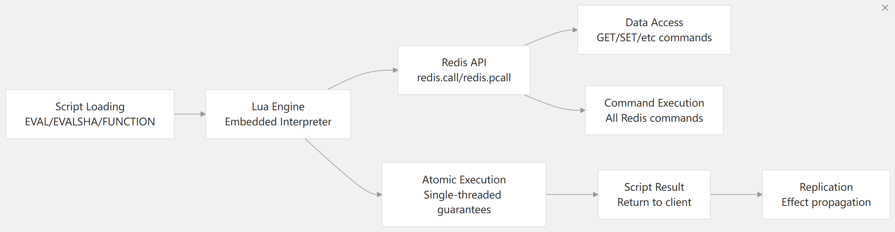

- 多种脚本执行方式
- 脚本执行在redis事件循环中是原子性的
- 可以执行redis指令
- 持久化函数：函数库持久化，服务器重启也没事。
- 脚本可以影响到副本和AOF日志

# 配置管理

- 配置文件redis.conf
- 运行时配置CONFIG GET/SET
- 标准配置系统： Type-safe configuration handling。有专门的standardConfig框架管理复杂配置
