本文介绍redis几种内存高效存储的数据结构，适合数据量小的集合。当数据量增大达到一定阈值，这些数据结构会自动转换为更通用的数据结构。

这些数据结构采用了紧凑的二进制编码，避免了指针开销。

虽然操作复杂性高）

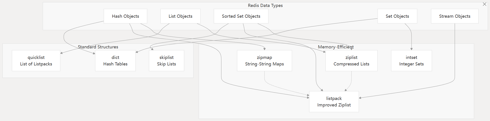

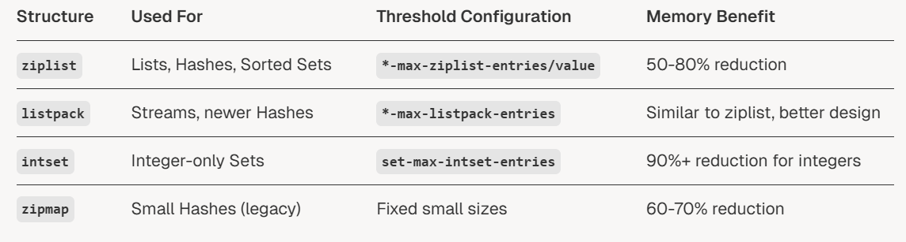

# Ziplist

压缩的双向链表，能存储字符串和整数。

后来被listpack取代了。

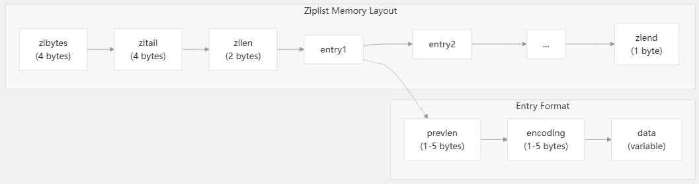

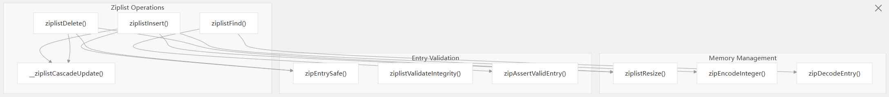

- 级联更新：当前entry的prelen字段记录上一个entry的长度。当prelen采用变长编码，一个entry的prelen的占用空间发生变化，可能导致后续所有entry的prelen占用空间发生变化，导致所有entry更新。但是比较极端。
- 安全检查
- 整数优化：超小整数直接编码到编码本身里面。

# Listpack

ziplist的优化，主要是为了解决级联更新。

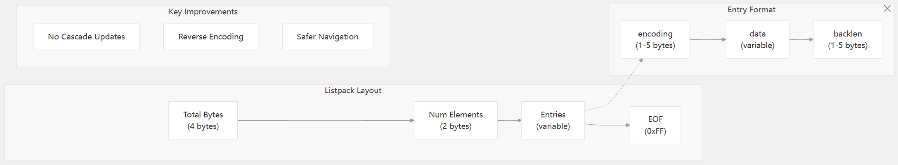

采用backlen反向编码，高效进行反向遍历

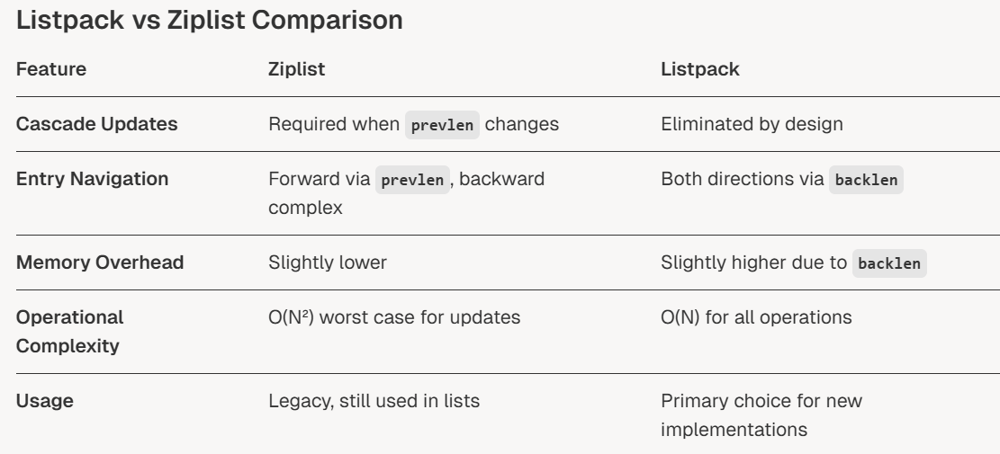

# Intset

自动排序数组，自动编码升级

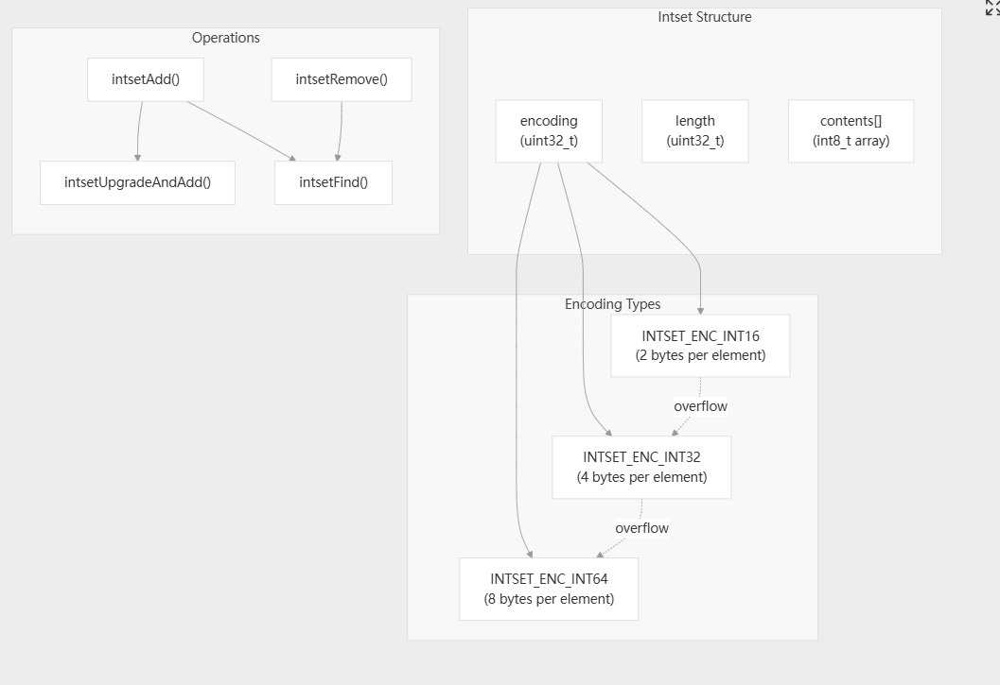

- 自动升级：当插入的new value需要更大的编码，整个intset都会升级
  - 判断所需的编码
  - 分配内存
  - 复制，从后往前复制避免覆写（如果数组起始地址没有变，只是扩长，那么就必须这样）
  - 插入new value在合适的位置
  - 更新编码，长度字段。
- 二分查找：这个整数集合是有序的
- 内存高效：直接用数组存，没有指针
- 字节序：通过memrev16ifbe()函数进行处理

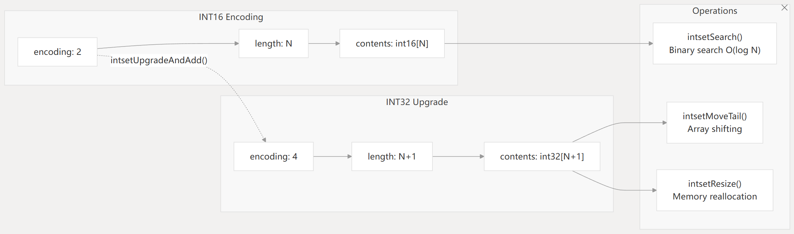

# Zipmap

提供内存高效String -> String  的映射，为了小哈希表设计。

带有长度前缀的线性布局。

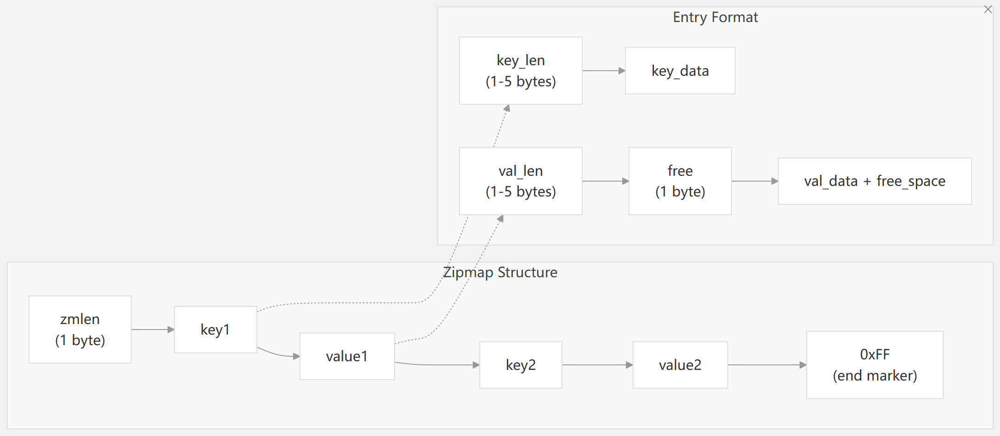

- 线性查找：但是对于小集合，缓存友好
- 空闲空间管理：value可以有尾随的空闲空间，减少内存分配次数。
- 长度编码：
- 内存高效：无指针，线性连续内存布局

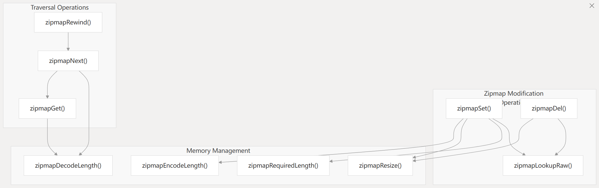

# 内存优化策略

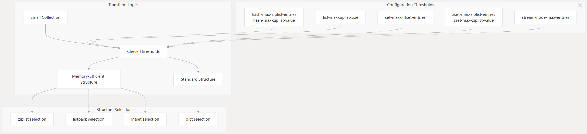

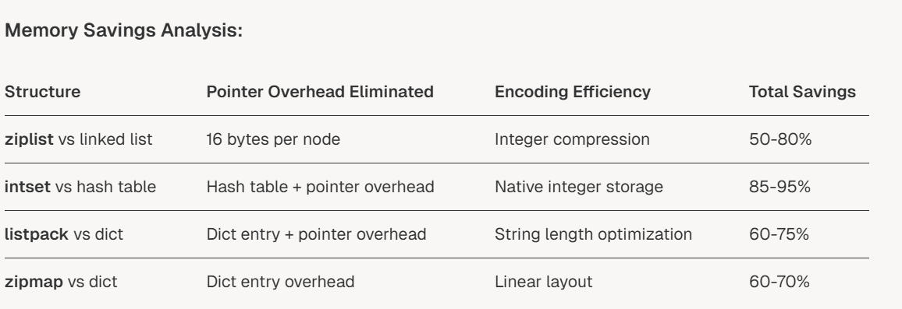

并且有校验机制保证数据完整性

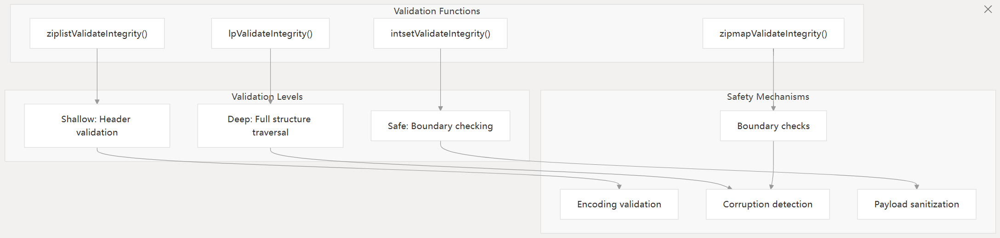

- 边界验证
- 编码验证
- 头信息中的大小验证
- 损坏测试：有测试可以检测错误的数据
