五种核心数据类型，关注内部的编码和内存优化策略，及转换机制。

注意下我的用词，redis数据类型和数据结构

数据类型指的是redis对外提供的功能接口，数据结构是实现前者的底层存储逻辑，编码。

# 概览和编码策略

每种数据类型内部都采用多种编码，根据大小和内容阈值透明切换。

保证了小集合的内存优化后和大集合的性能

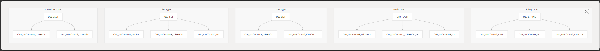

# String 实现

采用三种编码

- 针对整数的
- 针对短字符串的，内嵌在对象结构体中
- 针对长字符串，采用SDS

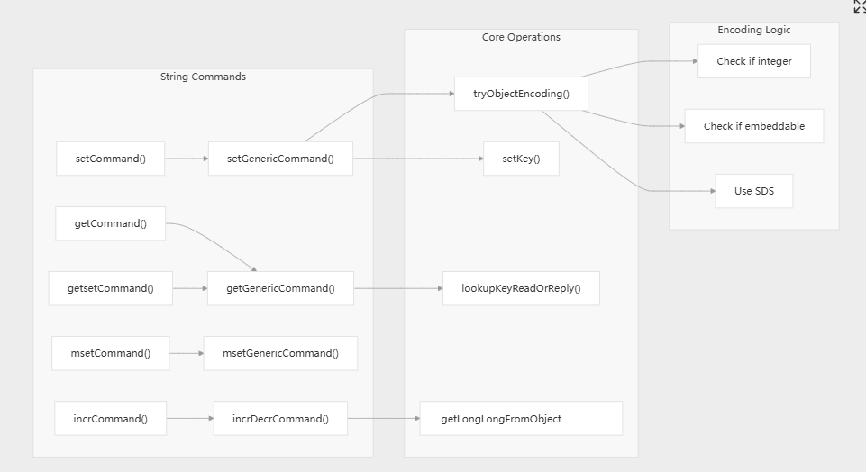

set指令的变体有很多nx，xx，ex，px的选项

get是原子性的get and set（cas操作）

# Hash 实现

采用复杂的多个编码，支持哈希字段的过期（HFE）。

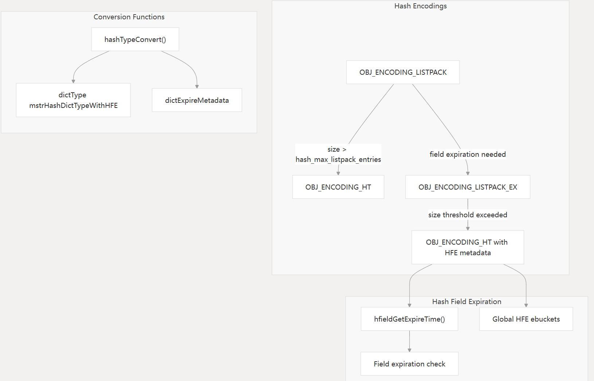

listpackEx结构体集成了常规的listpack编码，支持了每个字段的TTL，并按照TTL进行排序，便于清理。

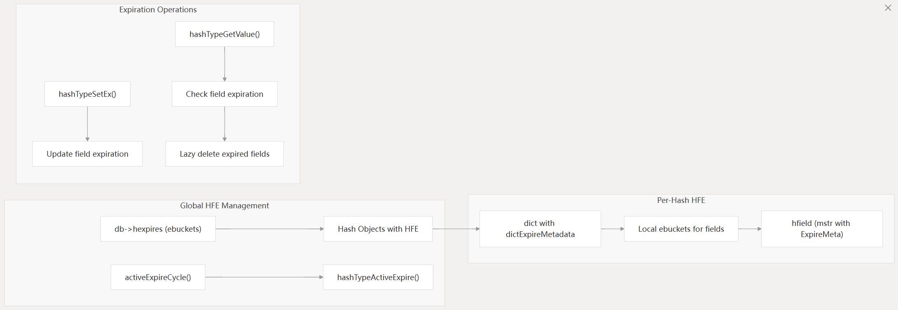

# List 实现

小list和大list分别采用不同编码

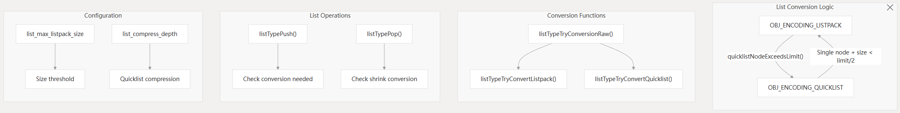

# Set 实现

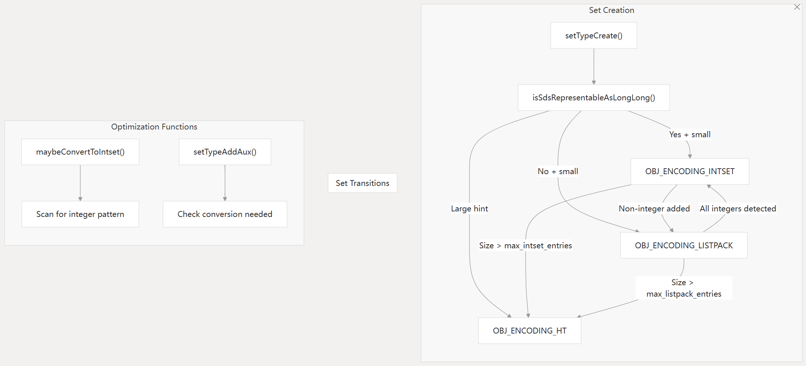

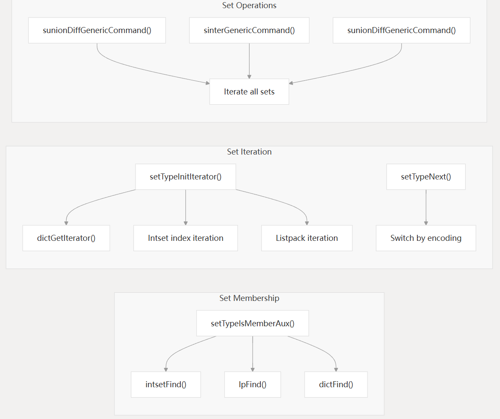

# ZSet 实现

根据不同访问模式采用双层数据结构

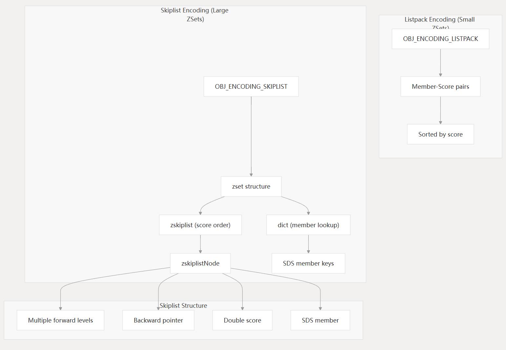

跳表底层同时在dict和跳表中实现了SDS字符串

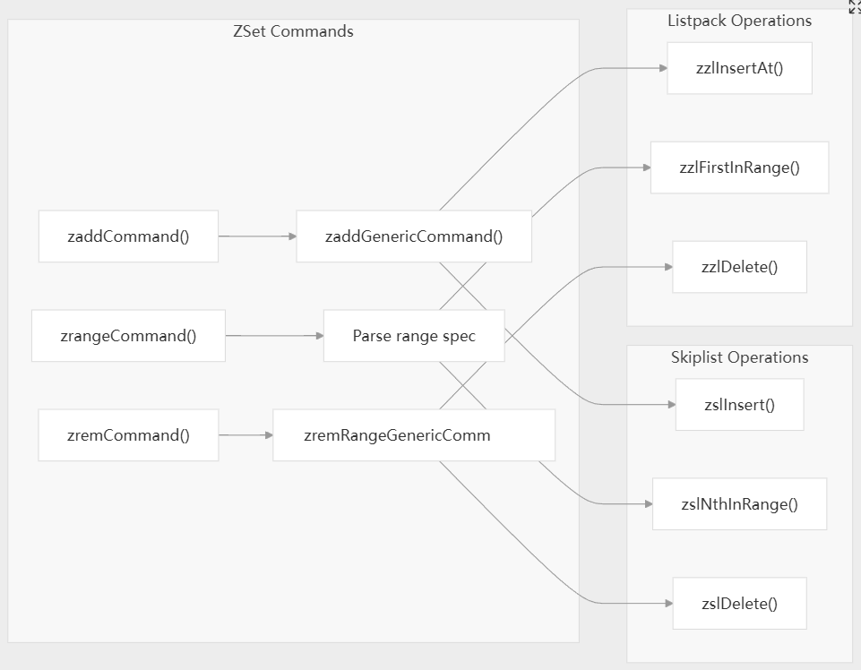

# 编码转换机制

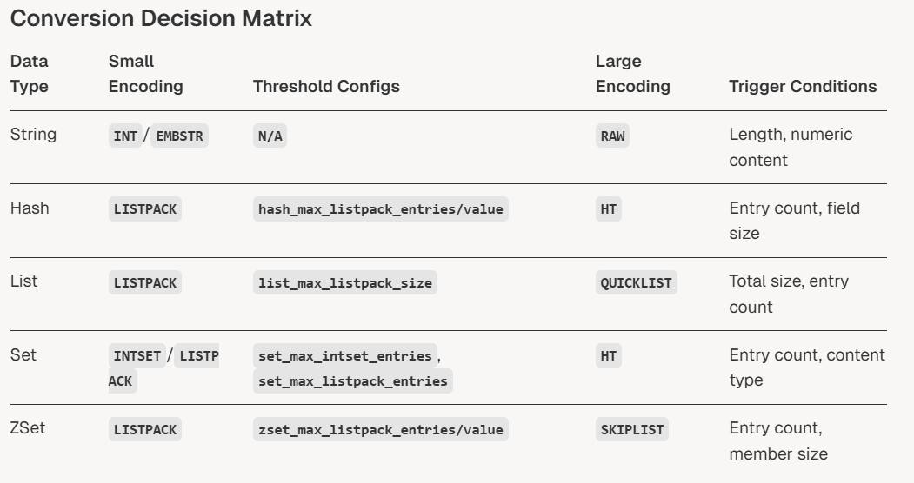

常见转换规则

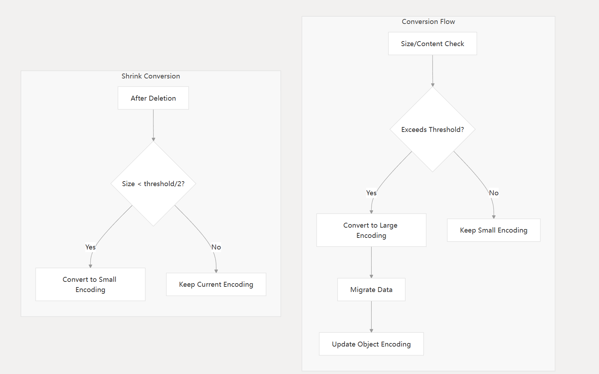

降级阈值通常是增长阈值的一半，是为了预防在边界频繁变化而引起编码频繁变化。

跟java的hashmap的链表红黑树转换一样。
