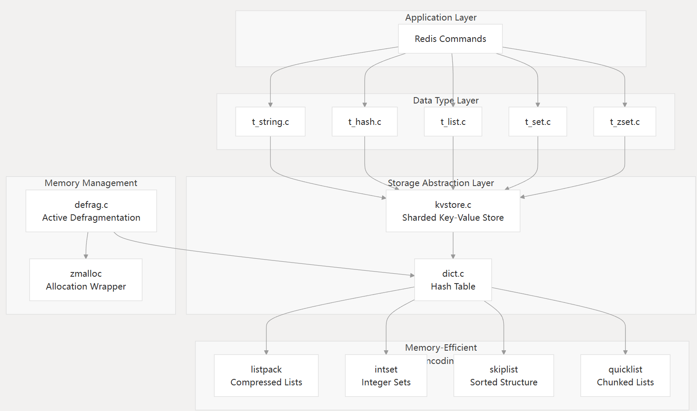
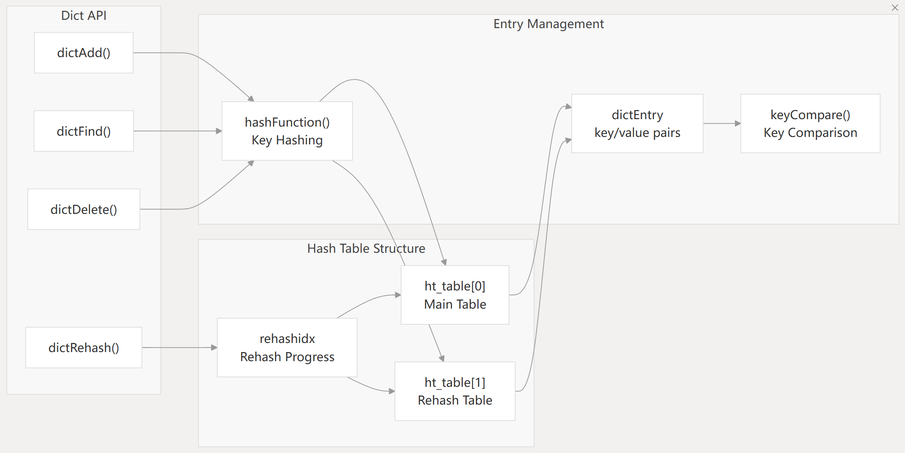
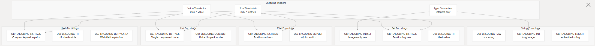
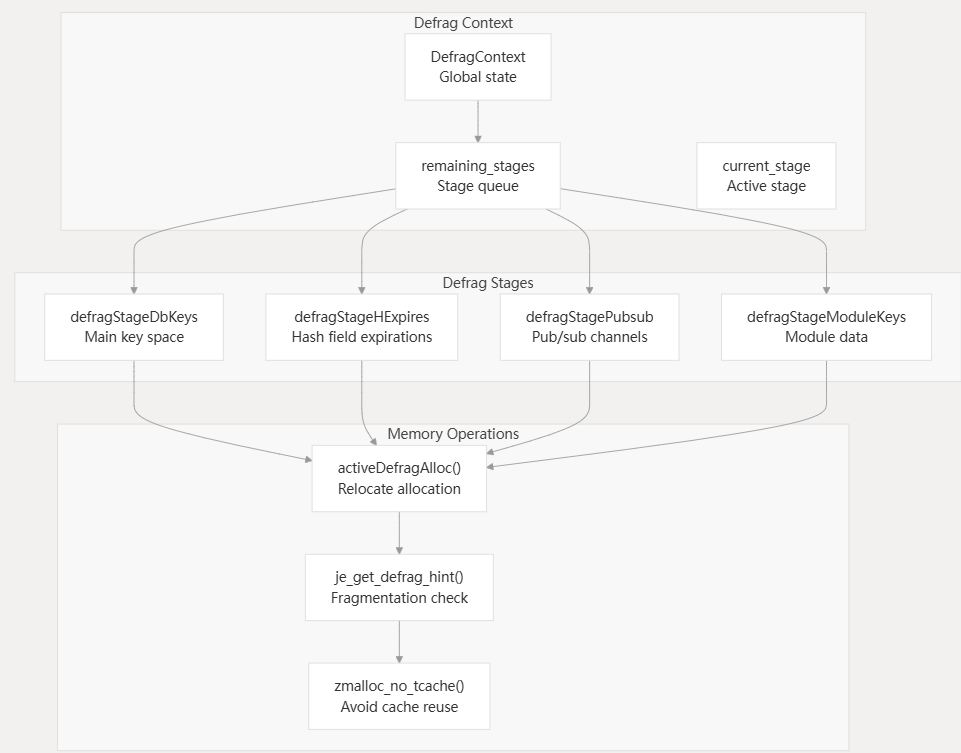
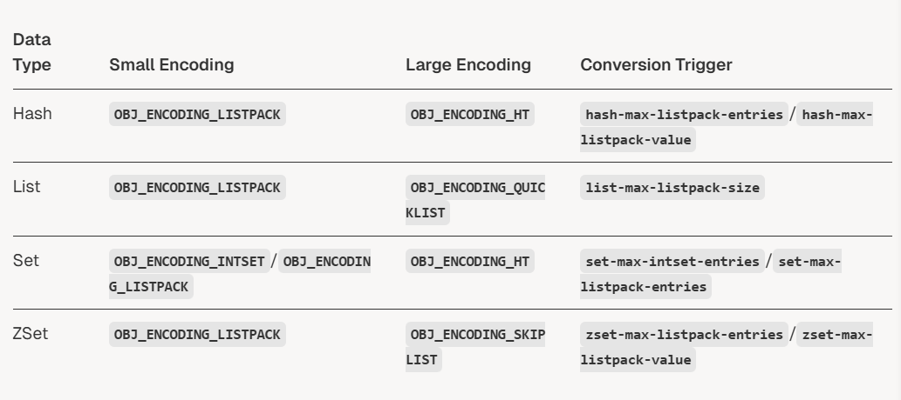
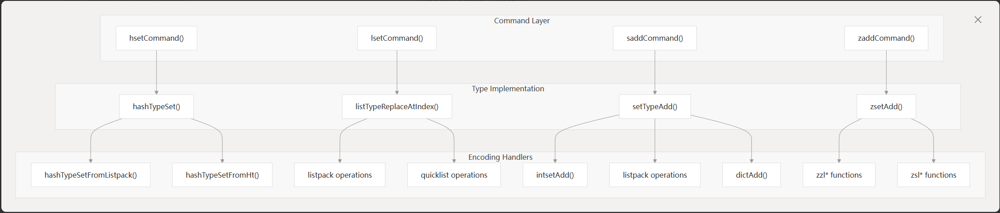

数据存储架构，关注基础机制和抽象，包含kv存储基础架构，数据类型编码策略，内存管理。

# 存储架构概览

采用分层存储架构，采用多个编码策略针对不同数据特征优化内存使用和性能。

核心思想就是使用基于数据大小和数据内容特征来选择内存高效的编码策略。

# 核心存储抽象

## dict

dict作为基础哈希表，实现了redis大多数数据结构，特别支持渐进式哈希来保证性能。

## KV存储分片

kvstrore抽象提供了一个dict数组来实现高效key分片。特别是集群模式

# 数据类型编码策略

redis为每种数据类型实现了多种编码策略，自动选择最优策略。

# 内存管理和优化

- 主动内存碎片整理系统：主动重新分配内存减少外部碎片。分阶段进行，延迟比较低。

  

- 编码转换触发器

  当超过一定阈值时，数据结构编码会自动转换

# KV操作

## 指令分发

redis命令通过特定的数据类型文件来分发，这些文件会处理特定编码的操作

## 存储效率

分层编码方法能节省大量内存占用。
