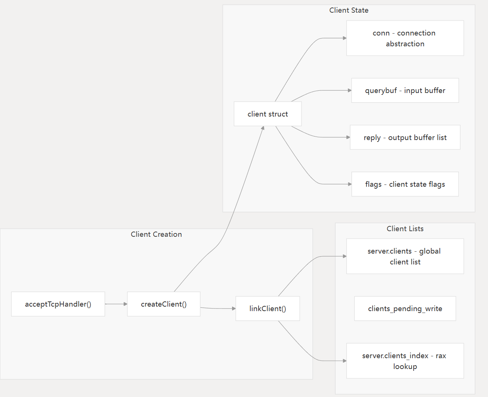
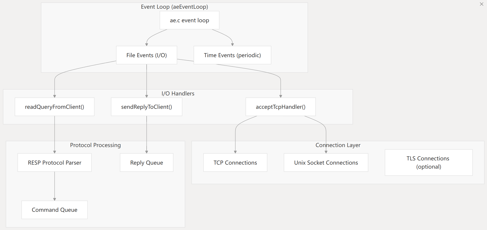
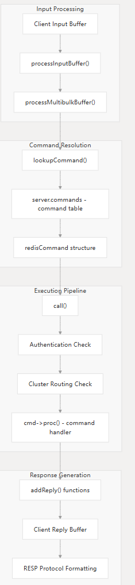
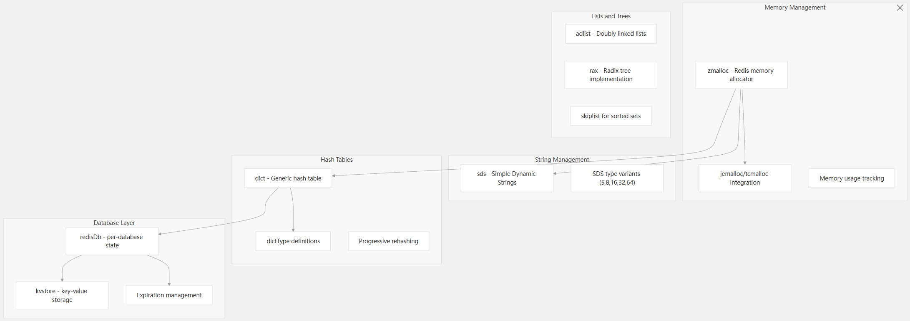
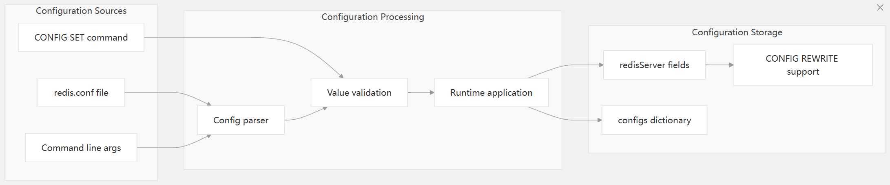
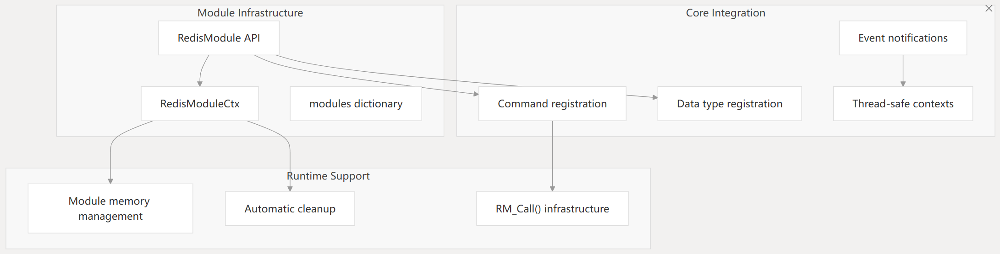
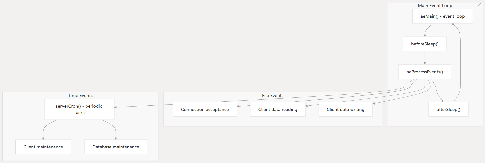

主要介绍redis核心服务器的架构，使得其称为内存高性能数据库。

主要就是全局状态管理，客户端连接管理，网络层，指令执行流水线，扩展集成店。

# 全局服务器状态

一个redisServer结构体，一个全局唯一的server实例维护所有的服务器状态（超过600字段）。

- 事件系统
  - el-AE事件循环
  - hz-服务器频率
  - cronloops-定时任务的迭代计数器
- 客户端管理
  - clients 活跃客户端列表
  - clients_index： rax树索引，快速查找客户端
  - next_client_id：原子计数器，生成下一个客户端id
- 数据库状态
  - db[] redisDB数组，每个元素都是一个redis数据库
  - dbnum 数据库数量
- 核心状态
  - 配置字段
  - pid：服务器进程id
  - 统计计数器们
  - 时间跟踪字段们

# 服务器初始化与生命周期

server.c中定义了明确的初始化流程，主函数入口初始化全局状态和初始化所有子系统

- 服务器初始化流（initServer())
  - 配置用于优雅关闭的信号处理器
  - 创建常用值共享对象
  - 事件循环初始化
  - 网络socket的创建和绑定
  - 数据库初始化
  - 定时任务调度

# 客户端连接架构

有一个专门的系统同时处理网络层和客户端连接

## 客户端结构和生命周期

创建-》授权-》指令执行-》销毁

创建方法要初始化：

- 连接抽象层connection
- 协议处理的输入输出缓冲
- 用户信息和授权状态
- 指令解析状态
- 内存使用追踪

## 网络连接与事件处理

网络连接层同时处理TCP和UNIX socker，使用可配置的IO线程。

# 指令执行流水线

redis实现了一套多阶段的指令处理流水线：协议解析，指令查找，指令执行，响应生成

核心组件

- 协议解析：RESP协议 processInputBuffer()
- 指令查找：哈希表查找 server.commands
- 执行上下文：call方法管理执行环境
- 响应格式：addReply*()格式化回复消息

# 核心数据结构和内存管理

redis核心依赖几个底层数据结构来支持更高级别的redis数据类型

核心数据结构

- SDS：简单动态字符串，多大小类
- dict：具有渐进式重哈希的哈希表
- kvstore：数据库层次的kv存储抽象
- rax：基于基数树的前缀树，用于前缀操作和索引。

# 配置系统

- 静态配置:配置文件
- 动态配置 config get/set
- 校验框架：配置值的特定类型验证
- 配置持久化：config rewrite可以更新配置文件

# 模块系统集成

- 大量API可用来开发模块
- 内存管理：自动清理和池化分配
- 指令集成：与redis命令无缝衔接
- 线程安全：对于多线程模块有线程安全的上下文

# 事件循环和定时任务

redis的核心操作使用单线程事件循环，而定时任务使用serverCron()进行管理

serverCron()发挥的作用

- 客户端超时和清理
- 数据库过期处理
- 内存使用监控
- 副本健康检测
- 统计更新

