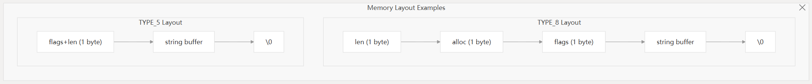
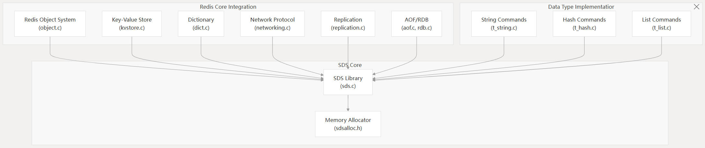

动态字符串库SDS是redis自己实现的高效，二进制安全（自动内存管理）。并且比C字符串多了O(1)长度查询，减少内存分配，能存储二进制数据。

其实就是一个对C字符串的现代化封装。

# 架构概览

SDS的元数据存储在字符串数据前面。

可以直接当做C字符串使用，并且维护了长度，分配信息等。

头部信息根据字符串实际长度设计了五种头部类型，最小化内存开销

# 核心功能

# 内存管理策略

采用多种内存扩展策略

- 贪心：额外分配，减少未来的内存分配
- 非贪心分配：只扩展实际需要的长度
- 头部结构体类型更新
- 内存压缩:

# 在Redis中的应用

作为Redis自定义的字符串类，在Redis中的数据结构，协议处理，内部操作等有广泛应用。

- Redis Object：String Object使用SDS来存值
- 协议处理：RESP协议解析和生成的指令和响应结果使用SDS
- Key 存储：dict的keys使用sds存储
- 副本：指令传播使用SDS来缓冲与传输
- 持久化：AOF指令和RDB字符串值使用SDS

# 变体和兼容性

Redis有两种SDS实现版本：主版本和hiredis版本。有些许差别

# 性能特点

相对于C字符串

- O(1)常数获取，因为SDS头有个len字段
- 减少内存分配：动态贪心分配内存
- 缓存友好布局：连续内存布局提升了缓存的表现
- 二进制安全：len字段能处理二进制数据，特别是null bytes
- 内存高效：头类型动态选择，最小化开销

还有一些自带库，比C库性能更高。
