dict(哈希表)和kv存储层管理了dict的集合。dict是用来存储kv键值对的，是redis的基本数据结构。

kv存储提供了更高层级的抽象用来管理dict，特别是集群配置。

dict实现的主要特点

- 渐进式rehash
- 主动碎片整理
- 内存高效存储优化

kv存储抽象层扩展了统计追踪，跨dict的rehash，单节点和集群部署

# dict架构

拉链法，2的次幂大小，渐进式rehash

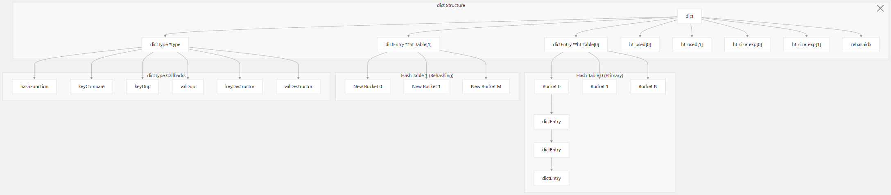

维护了两个哈希表来实现渐进式重哈希，平时只有表0在使用。当需要扩展时，表1会分配内存，并且逐渐从旧表迁移数据到新表。

对于不同的节点类型，dict使用指针位操作来最小化内存使用。

利用的现代计算机体系结构的特性，特别是哈希桶中只有一个元素时直接存入，减少内存开销。

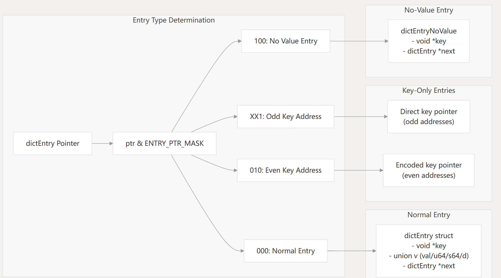

# 哈希函数和冲突解决

使用sipHash作为默认哈希，适合拉链法

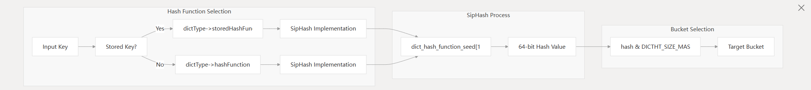

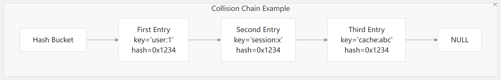

# 渐进式rehash

避免哈希表扩容或缩容时阻塞

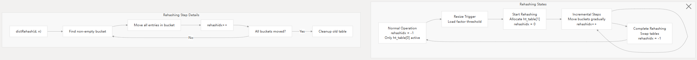

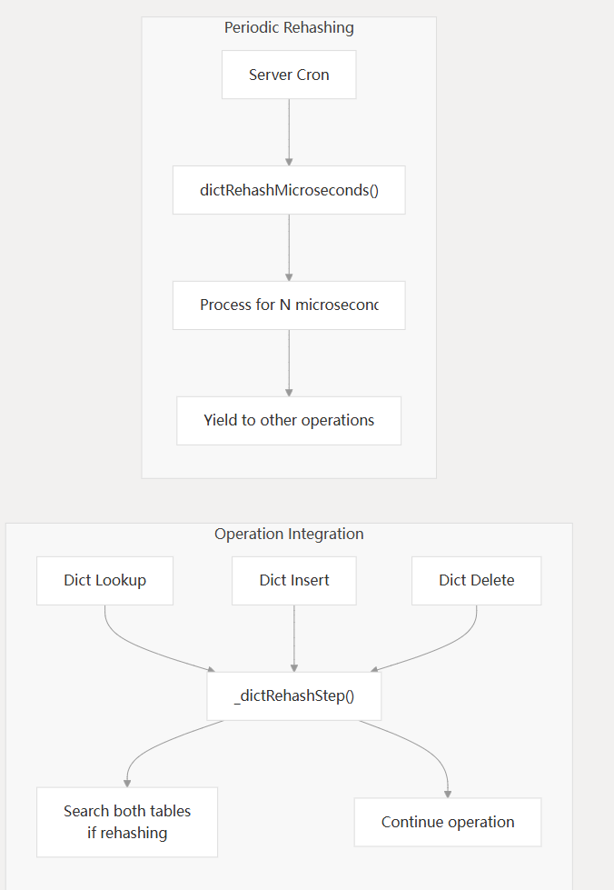

# KV存储层

提供了一个更高层次的抽象来管理多个dict，特别是集群模式下

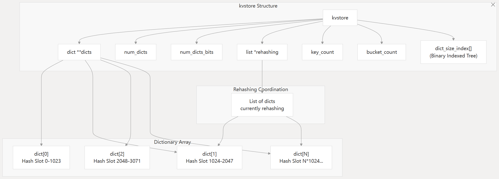

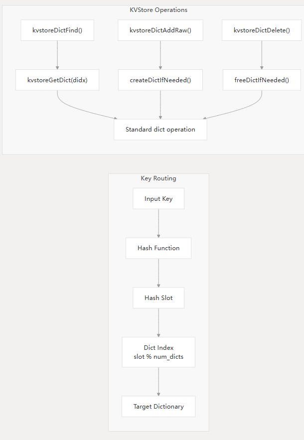

使用Fenwick Tree来支持跨dict的范围查询

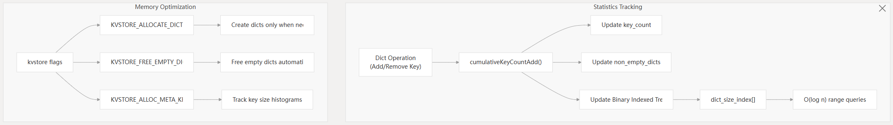

# 在Redis核心中的应用

使用不同的dictType

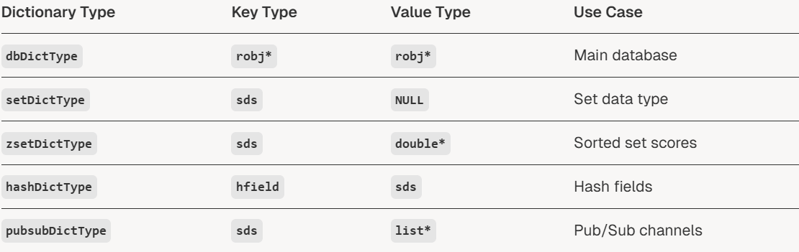

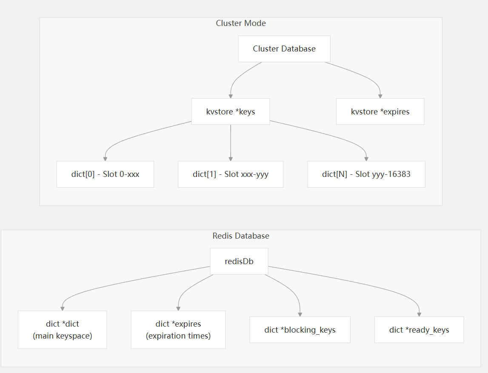
