dict(哈希表)和kv存储层管理了dict的集合。dict是用来存储kv键值对的，是redis的基本数据结构。

kv存储提供了更高层级的抽象用来管理dict，特别是集群配置。

dict实现的主要特点

- 渐进式rehash
- 主动碎片整理
- 内存高效存储优化

kv存储抽象层扩展了统计追踪，跨dict的rehash，单节点和集群部署

# dict架构

拉链法，2的次幂大小，渐进式rehash。


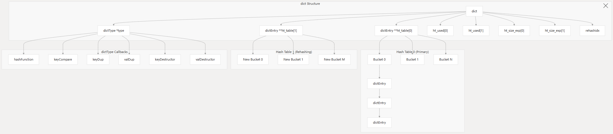

维护了两个哈希表来实现渐进式重哈希，平时只有表0在使用。当需要扩展时，表1会分配内存，并且逐渐从旧表迁移数据到新表。

```C
struct dict {
    dictType *type;

    dictEntry **ht_table[2];
    unsigned long ht_used[2];

    long rehashidx; /* rehashing not in progress if rehashidx == -1 */

    /* Keep small vars at end for optimal (minimal) struct padding */
    unsigned pauserehash : 15; /* If >0 rehashing is paused */

    unsigned useStoredKeyApi : 1; /* See comment of storedHashFunction above */
    signed char ht_size_exp[2]; /* exponent of size. (size = 1<<exp) */
    int16_t pauseAutoResize;  /* If >0 automatic resizing is disallowed (<0 indicates coding error) */
    void *metadata[];
};

struct dictEntry {
    struct dictEntry *next;  /* Must be first */
    void *key;               /* Must be second */
    union {
        void *val;
        uint64_t u64;
        int64_t s64;
        double d;
    } v;
};

//不存储值，专门用于set
typedef struct dictEntryNoValue {
    dictEntry *next; /* Must be first */
    void *key;       /* Must be second */
} dictEntryNoValue;

// 这个相当于接口，可以自己实现哈希表各种操作
typedef struct dictType {
    /* Callbacks */
    uint64_t (*hashFunction)(const void *key);
    void *(*keyDup)(dict *d, const void *key);
    void *(*valDup)(dict *d, const void *obj);
    int (*keyCompare)(dictCmpCache *cache, const void *key1, const void *key2);
    void (*keyDestructor)(dict *d, void *key);
    void (*valDestructor)(dict *d, void *obj);
    int (*resizeAllowed)(size_t moreMem, double usedRatio);
    /* Invoked at the start of dict initialization/rehashing (old and new ht are already created) */
    void (*rehashingStarted)(dict *d);
    /* Invoked at the end of dict initialization/rehashing of all the entries from old to new ht. Both ht still exists
     * and are cleaned up after this callback.  */
    void (*rehashingCompleted)(dict *d);
    /* Invoked when the size of the dictionary changes.
     * The `delta` parameter can be positive (size increase) or negative (size decrease). */
    void (*bucketChanged)(dict *d, long long delta);
    /* Allow a dict to carry extra caller-defined metadata. The
     * extra memory is initialized to 0 when a dict is allocated. */
    size_t (*dictMetadataBytes)(dict *d);

    /* Data */
    void *userdata;

    /* Flags */
    /* The 'no_value' flag, if set, indicates that values are not used, i.e. the
     * dict is a set. When this flag is set, it's not possible to access the
     * value of a dictEntry and it's also impossible to use dictSetKey(). It 
     * enables an optimization to store a key directly without an allocating 
     * dictEntry in between, if it is the only key in the bucket. */
    unsigned int no_value:1;
    /* This flag is required for `no_value` optimization since the optimization
     * reuses LSB bits as metadata */ 
    unsigned int keys_are_odd:1;

    /* Ensures that the entire hash table is rehashed at once if set. */
    unsigned int force_full_rehash:1;

    /* Sometimes we want the ability to store a key in a given way inside the hash
     * function, and lookup it in some other way without resorting to any kind of
     * conversion. For instance the key may be stored as a structure also
     * representing other things, but the lookup happens via just a pointer to a
     * null terminated string. Optionally providing additional hash/cmp functions,
     * dict supports such usage. In that case we'll have a hashFunction() that will
     * expect a null terminated C string, and a storedHashFunction() that will
     * instead expect the structure. Similarly, the two comparison functions will
     * work differently. The keyCompare() will treat the first argument as a pointer
     * to a C string and the other as a structure (this way we can directly lookup
     * the structure key using the C string). While the storedKeyCompare() will
     * check if two pointers to the key in structure form are the same.
     *
     * However, functions of dict that gets key as argument (void *key) don't get
     * any indication whether it is a lookup or stored key. To indicate that
     * you intend to use key of type stored-key, and, consequently, use
     * dedicated compare and hash functions of stored-key, is by calling
     * dictUseStoredKeyApi(1) before using any of the dict functions that gets
     * key as a parameter and then call again  dictUseStoredKeyApi(0) once done.
     *
     * Set to NULL both functions, if you don't want to support this feature. */
    uint64_t (*storedHashFunction)(const void *key);
    int (*storedKeyCompare)(dictCmpCache *cache, const void *key1, const void *key2);

    /* Optional callback called when the dict is destroyed. */
    void (*onDictRelease)(dict *d);
} dictType;

```


对于不同的节点类型，dict使用指针位压缩操作来最小化内存使用。

利用的现代计算机体系结构的特性，内存分配是按照8字节对齐的，因此指针地址后三位永远是0，因此可以存入一些信息，提升内存利用率。

快速判断一个哈希条目的类型（分为正常，奇偶地址和空）

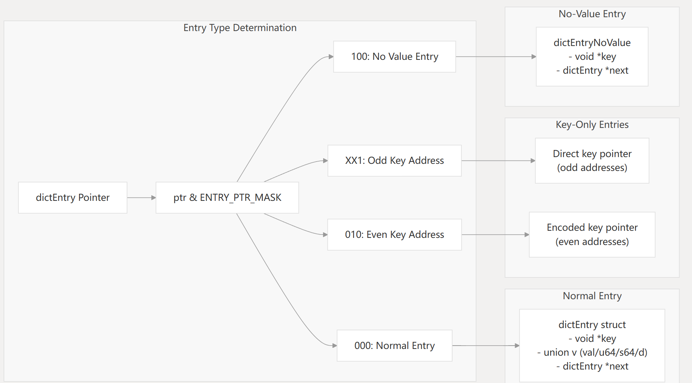

```C
/* --------------------- dictEntry pointer bit tricks ----------------------  */

/* The 3 least significant bits in a pointer to a dictEntry determines what the
 * pointer actually points to. If the least bit is set, it's a key. Otherwise,
 * the bit pattern of the least 3 significant bits mark the kind of entry. */

#define ENTRY_PTR_MASK        7 /* 111 */
#define ENTRY_PTR_NORMAL      0 /* 000 : If a pointer to an entry with value. */
#define ENTRY_PTR_IS_ODD_KEY  1 /* XX1 : If a pointer to odd key address (must be 1). */
#define ENTRY_PTR_IS_EVEN_KEY 2 /* 010 : If a pointer to even key address. (must be 2 or 4). */
#define ENTRY_PTR_UNUSED      4 /* 100 : Unused. */

/* Returns 1 if the entry pointer is a pointer to a key, rather than to an
 * allocated entry. Returns 0 otherwise. */
static inline int entryIsKey(const dictEntry *de) {
    return ((uintptr_t)de & (ENTRY_PTR_IS_ODD_KEY | ENTRY_PTR_IS_EVEN_KEY));
}

/* Returns 1 if the pointer is actually a pointer to a dictEntry struct. Returns
 * 0 otherwise. */
static inline int entryIsNormal(const dictEntry *de) {
    return ((uintptr_t)(void *)de & ENTRY_PTR_MASK) == ENTRY_PTR_NORMAL;
}

/* Creates an entry without a value field. */
static inline dictEntry *createEntryNoValue(void *key, dictEntry *next) {
    dictEntryNoValue *entry = zmalloc(sizeof(*entry));
    entry->key = key;
    entry->next = next;
    return (dictEntry *) entry;
}

static inline dictEntry *encodeMaskedPtr(const void *ptr, unsigned int bits) {
    assert(((uintptr_t)ptr & ENTRY_PTR_MASK) == 0); //保证低三位为0
    return (dictEntry *)(void *)((uintptr_t)ptr | bits);
}

static inline void *decodeMaskedPtr(const dictEntry *de) {
    return (void *)((uintptr_t)(void *)de & ~ENTRY_PTR_MASK);
}

/* Decodes the pointer to an entry without value, when you know it is an entry
 * without value. Hint: Use entryIsNoValue to check. */
static inline dictEntryNoValue *decodeEntryNoValue(const dictEntry *de) {
    return decodeMaskedPtr(de);
}

/* Returns 1 if the entry has a value field and 0 otherwise. */
static inline int entryHasValue(const dictEntry *de) {
    return entryIsNormal(de);
}
```


# 哈希函数和冲突解决

使用sipHash作为默认哈希，使用拉链法

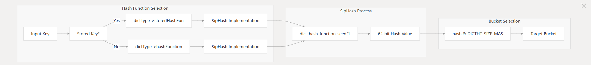

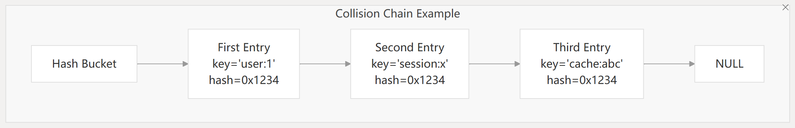

```C
uint64_t siphash(const uint8_t *in, const size_t inlen, const uint8_t *k);
uint64_t siphash_nocase(const uint8_t *in, const size_t inlen, const uint8_t *k);

uint64_t dictGenHashFunction(const void *key, size_t len) {
    return siphash(key,len,dict_hash_function_seed);
}

uint64_t dictGenCaseHashFunction(const unsigned char *buf, size_t len) {
    return siphash_nocase(buf,len,dict_hash_function_seed);
}

static inline uint64_t dictHashKey(dict *d, const void *key, int isStoredKey) {
    if (isStoredKey && d->type->storedHashFunction)
        return d->type->storedHashFunction(key);
    else
        return d->type->hashFunction(key);
}
```


# 渐进式rehash

避免大哈希表扩容或缩容时阻塞。

采用双哈希表实现平滑扩容和缩容，每次操作最多迁移一个桶。

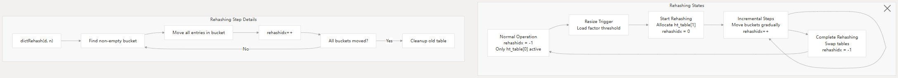

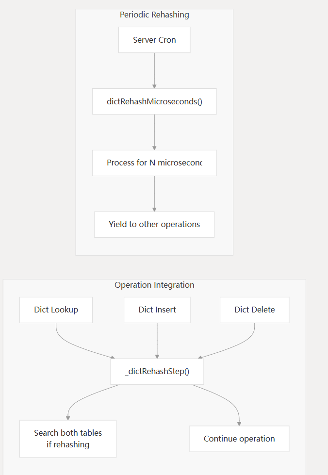

Redis提供了一个函数用于ban自动扩容和重哈希操作。

比如执行执行BGSAVE或者BGREWRITEAOF时，由于Redis会创建子进程，并使用写时复制COW，为了减少内存消耗，Redis会暂时禁用这扩容和重哈希。

也有例外，比如负载因子很大（static unsigned int dict_force_resize_ratio = 4）或者很小，也会触发扩容和缩容。

# KV存储层

提供了一个更高层次的抽象来管理多个dict，特别是集群模式下

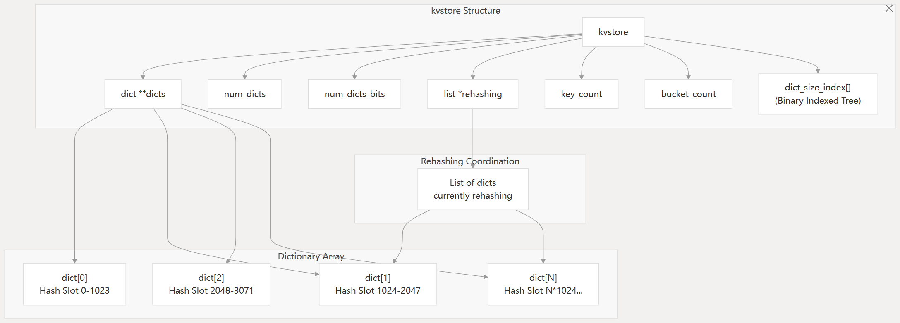


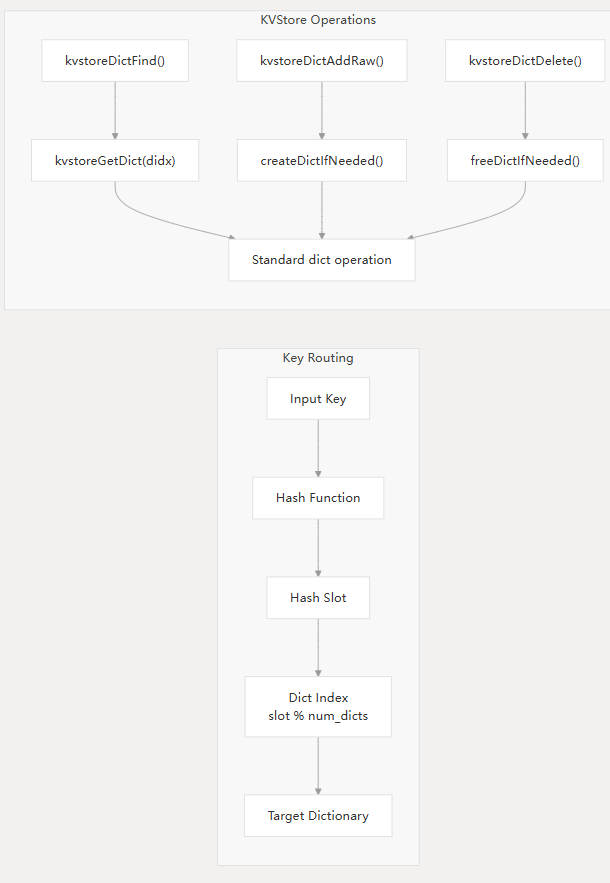

使用Fenwick Tree来支持跨dict的范围查询

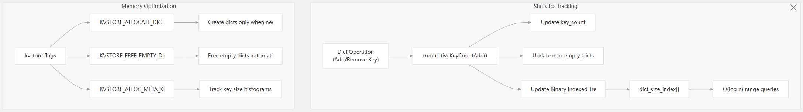

# 在Redis核心中的应用

使用不同的dictType

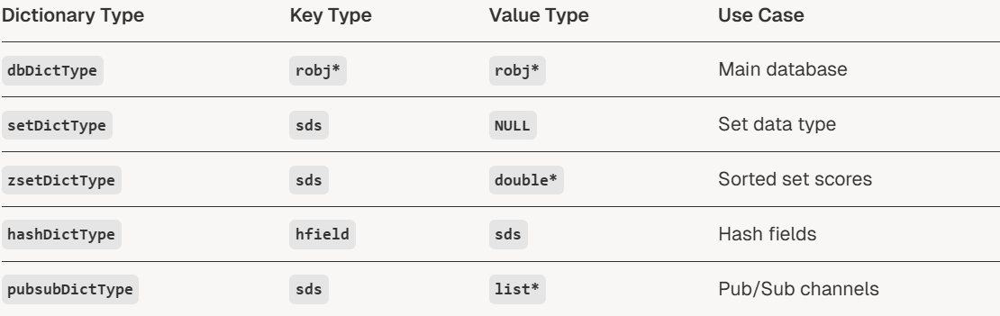

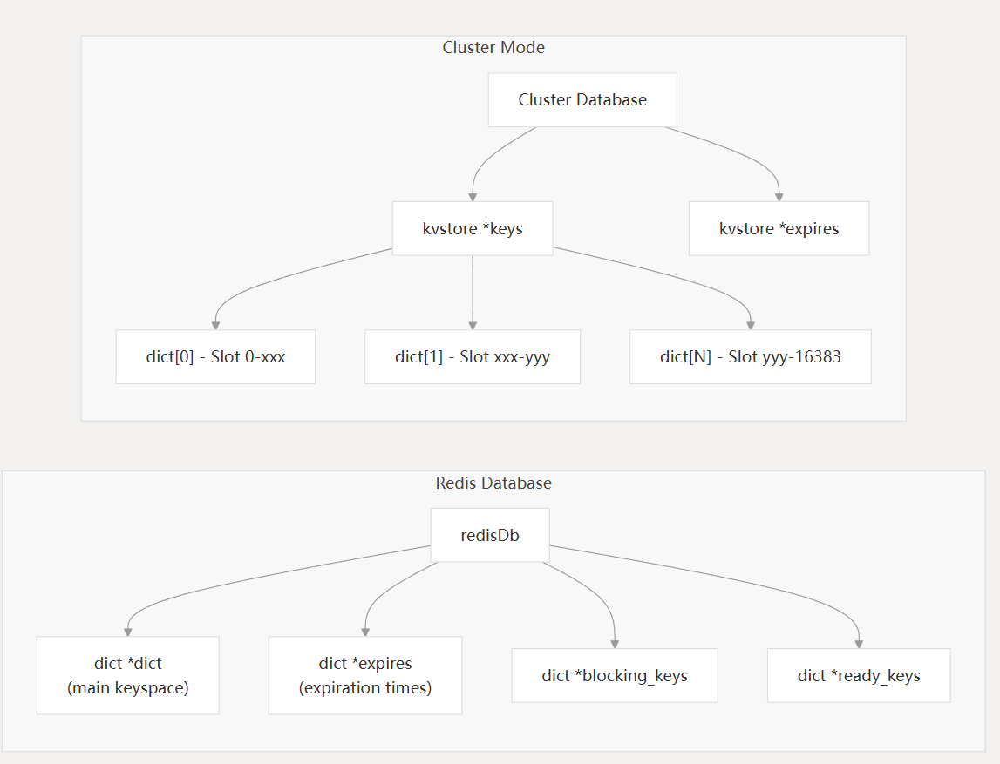
