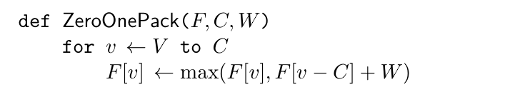

# 背包九讲

dp的核心就是问题有最优子结构，问题的最优解可以从子问题的最优解转移而来。

存储了当前状态的最优值，然后通过子问题的最优值来推到父问题的最优值，减少了很多无用子集的枚举和遍历，非最优的子问题解直接抛弃。

另一个就是无后效性，前i个物品最优解不会被i+1之后物品影响


## 01背包

N个物品，每个物品的体积为Ci，价值为Wi。有一个容积为V的背包，求选择哪些物品价值总和最大。

特点：每个物品只有一种，放或者不放。

用子问题定义状态：`f[i][v]`表示前i个物品恰放入一个容量为v的背包可以获得的最大价值。

考虑第i个物品放或者不放，转化为一个只和前i-1件物品相关的问题。

- 不放：转换为前i-1个物品放入容量为v的背包

- 放：转换为前i-1个物品放入容量为v-Ci的背包

$f[i][v]=max\{f[i-1][v],f[i-1][v-C_i]+W_i\}$

边界条件就是`f[0][0...v]`为0，因为这个时候物品集合是空的。

```java
for(int i=1;i<=N;++i){
        for(int v=C[i];v<=V;++v){
            f[i][v]=max(f[i-1][v],f[i-1][v-C[i]]+W[i]);
        }
 }
```

时间复杂度是VN了，无法优化。但是空间可以优化到V。

因为`f[i][]`只依赖于`f[i-1][]`，至于`f[0][]...f[i-2][]`都是不需要的，可以省略掉。我们的目的是在第i次循环，计算`f[i][v]`,能够取到`f[i-1][v] & f[i-1][v-Ci]`。因此不难想到`f[2][]`这样一个数组就行了，可以用取模实现循环数组。


再优化下，我们将第二重循环逆序遍历，就能符合我们要求。

这样在计算`f[v]`时,优先更新数组v比较大的，并且是从本数组中v比较小的更新来的，v比较小的存的是前i个物品的状态值。我们每次循环，只考虑第i个物品。可以理解为一个尺子，v比较大的往前跳Ci格来更新状态。

```java
for(int i=1;i<=N;++i){
        for(int v=V;v>=C[i];--v){
            f[v]=max(f[v],f[v-C[i]]+W[i]);
        }
 }
```


有的题目要求恰好装满，那么初始化时f[0]为0，f[1...V]为-无穷，因为这是非法状态。如果不要求装满，那么任何容量的背包都有一个合法解（什么也不装)。


一个常数优化。第二重循环的下限可以改进为
```java
for(int i=1;i<=N;++i){
        for(int v=V;v>=max(V-SUM{Ck,k from i ...N},C[i]);--v){
            f[v]=max(f[v],f[v-C[i]]+W[i]);
        }
 }
```

- 装不下当前物品：下限至少是Ci吧，如果背包小于这个，都选不了第i个，直接保留i-1的状态,即不选择
- 暂时理解不了bandon


## 完全背包

01背包，但是每个物品有无限个。这就不是选或者不选的策略了，而是选多少的问题。

如果要枚举每个物品的数量，那么时间复杂度大概是 VN sum{V/Ci} 了，很大了。就要加一重循环。

简单的优化就是性价比优化），排除性价比低的物品，体积大于背包的，相同体积保留价值大的。


转换为01背包，将一件物品转换为多件物品，但更高效的是二进制拆分。因为最优策略选几件，都可以二进制拆分为选几个2^K个物品的和。这样物品总量显著下降。


VN的解法

```java
for(int i=1;i<=N;++i){
        for(int v=C[i];v<=V;++v){
            f[v]=max(f[v],f[v-C[i]]+W[i]);
        }
 }
```

01背包必须逆序，避免重复选，而完全背包可以重复选，这就是特点。

还可以这样理解

$f[i][v]=max\{f[i-1][v],f[i][v-C_i]+W_i\}$

##  多重背包

每个物品都有一个独立的数量Mi。

思路就是01背包加一重循环咯，枚举选几个。可以使用二进制拆分来处理。如果特定物品全选的话容量大于V，可以对这个物品做完全背包

还有个单调队列优化为VN的，abandon（从初中到现在的坑还没填）

## 混合背包

物品中存在1件，Mi件，无穷件。根据情况，再容量循环根据情况选择正序或者逆序，还有进行二进制拆分。

## 二维费用背包

普通的背包只有容积这个消费，二维背包就是再加一个。

就是多加一重循环的事情。有时候费用可以理解为件数,最多选U件什么的，那么一件的费用就是1.

## 分组背包

01背包，但是物品集合划分为若干子集合，每个子集合最多只能选一个物品。

对于每个组

- 所有都不选
- 选择该组的其中一件

其实就是01背包多一重循环。同一个组的物品可以进行简单的优化排除，从性价比的角度来优化常数


## 有依赖的背包

要选第j件物品，必须选了第i件才可以。

简单起见，依赖链条长度只有i<---j, 不存在i<---j<---k,并且最多只依赖一个。

常规的思路，就是将i和依赖它的组成一个集合，按照01背包的思路来，但是选了i，它的依赖集合有n个，那么选几个，就会有指数级的方案。不行。 这些方案是互斥的，考虑转换为分组背包，转换为物品组集合，但是组内的物品照样很多。


尝试对分组背包化后的物品组集合进行优化，费用相同的留价值最大的（原本想着直接贪心，性价比什么的，但是这不是要枚举指数级方案吗）。这不就是相当于一个简单的背包吗，固定容积下价值最大化。对这个物品集合做一个01背包即可。

假设这个物品集合都依赖于k，那么做体积0...V-Ck的背包就行了。通过这个做法，将物品集合的指数级方案减少了很多冗余方案。


如果是更一般的问题,比如依赖关系是森林（一个物品最多只依赖一个物品，且不能有循环依赖），一个附件可能还有附件。感觉这有点像树形DP了。对父节点问题求值之前，要先对子节点问题进行求值，自下而上进行dp。这有点像泛化物品，这个依赖关系树每个子树都等价于一个泛化问题，求某节点为根的子树的泛化物品相当于求其所有儿子对应的泛化物品之和


## 泛化物品

泛化物品：一种没有固定价值，费用的物品。物品的价值随着分配给它的费用变化而变化。泛化物品是一个定义域为0...V的函数h，费用为v，价值为h(v)。

这样01背包，完全背包，多重都可以用这样一个特定的h来表示。这个h不是什么连续的，可能在定义域上就一个点。

对于一个物品组，h（v）就是费用为v的物品的最大价值。


给定两个泛化物品h和l，和一定的费用，怎么分配费用使得**价值和**f最大？感觉只能想到枚举费用的分配，可以转换为背包。这就是泛化物品的和，时间复杂度是V^2。

由泛化物品的基本定义可知，两个泛化物品的和可以看成意见物品的和。

感觉还是很抽象）。反正背包问题可能有很多限制，条件。但是对于一个非负整数v，都可以求得v下，将物品装入的最大价值。当成一件泛化物品。反正就是要求解这个泛化物品所对应的函数。常见的做法是将若干泛化物品的和看成一件泛化物品然后继续求。

对算法题要多思考，多抽象。


## 背包问题的变种

如果是要总价值，件数最小，改成min就行了。

输出方案：要再多开一个数组表示当前状态最优值由哪一个策略推到出来的，即是否第选了i个？也可以不记录，实际倒推计算，计算方案多花点时间罢了。但是都要记录方案了，你01背包真得要用两维了）。

字典序最小方案：子问题描述变了，选了1，那么子问题变成容量为V-C1，物品为2...N的子问题。不选也是2...N，和之前的1...i前i个物品的形式不一样了，物品变成i...N。  更简单的做法是将 第x件物品变成N+1-X，输出方案再变换回来。 如果`f[i][v]=f[i-1][v]=f[i-1][v-Ci]+Wi`，要按照后者来输出，选择了i，输出其原来的编号N-1-i？有点迷，以后在看看。

总方案数：将max改成sum，`F[0][0]=1`

最优方案数：额外再开一个二维数组好了。一个记录最大价值，一个记录当前方案和。

次优解，第k优解：最优解可以用DP来解决，那么这俩个一般都能用dp解决，复杂度多了个K。基本思想就是每个状态表示为有序队列，将状态转移方程中的max/min转换为有序队列的合并。将原来的一个状态拆分为一个包含k个状态的有序队列，可以理解加了一维来表示多个优解。还有这个K是否需要什么重复的。看题吧


## 作者一些优雅的伪代码

使用py的，将算法抽象为一块块过程。然后最后甚至可以混合组合应用，抽象的威力就在这里，将复杂的问题拆分为一个个具体的，抽象过的解法。




